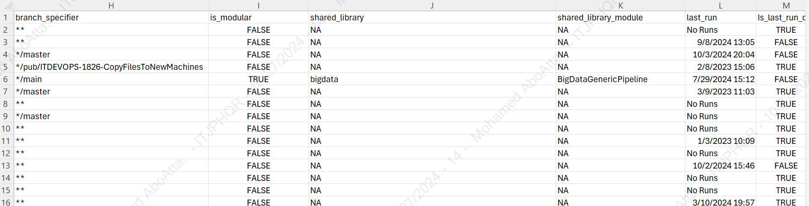
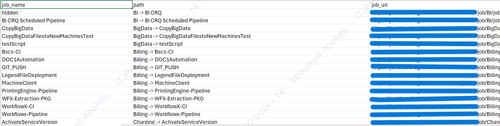
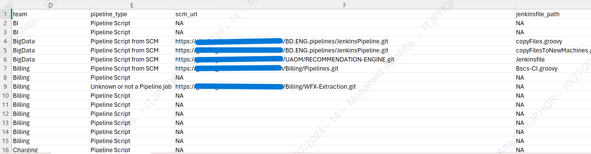
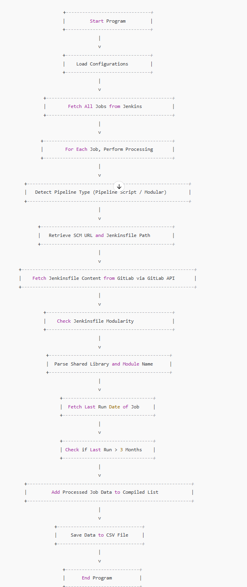

<a name="readme-top"></a> 

![LinkedIn][linkedin-shield]

<!-- PROJECT LOGO -->
<br />
<div align="center">
    
  <h3 align="center">Pipelines Consolidator for Modular Architecture</h3>
</div>

<!-- TABLE OF CONTENTS -->
<details>
  <summary>Table of Contents</summary>
  <ol>
    <li>
      <a href="#about-the-project">About The Project</a>
      <ul>
<li><a href="#business-case">Business Case</a></li>
        <li><a href="#technical-solution">Technical Solution</a></li>
        <li><a href="#features">Features</a></li>
        <li><a href="#screenshots">Screenshots</a></li>
      </ul>
    </li>
    <li><a href="#getting-started">Getting Started</a></li>
    <ul>
        <li><a href="#prerequisites">Prerequisites</a></li>
        <li><a href="#configuration">Configuration</a></li>
    </ul>
    <li><a href="#usage">Usage</a></li>
    <li><a href="#api-endpoints">API Endpoints</a></li>
    <li><a href="#flowchart">Flowchart</a></li>
    <li><a href="#contact">Contact</a></li>
  </ol>
</details>

<!-- ABOUT THE PROJECT -->
## About The Project



* **Project Name:** Pipelines Consolidator for Modular Architecture
* **Version:** v1.0.0  
* **Department:** DevOps

---

### Business Case

The **Pipelines Consolidator** was developed to provide a centralized, comprehensive view of all Jenkins jobs within the organization. With over 900 jobs, there was a need to analyze their configurations and the structure of their Jenkinsfiles to assess whether they align with the company's modular design standards. This solution enables teams to identify legacy pipelines that do not adhere to modular design principles, facilitating the transition to more maintainable and consistent configurations.

### Technical Solution

The solution is a Python-based tool that connects to both Jenkins and GitLab APIs to retrieve, process, and analyze pipeline data for each Jenkins job. Key steps include:

1. **Automated Job Retrieval**: The tool fetches all available Jenkins jobs (including nested ones) and captures essential information, such as pipeline type, SCM URL, and Jenkinsfile path.
2. **Modularity Analysis**: Using GitLab API, the tool inspects each job’s Jenkinsfile to determine if it follows the modular design approach by identifying shared libraries and module names.
3. **Data Export**: The tool generates a structured CSV report that provides details for each job, such as its modularity status, last run date, and associated team.
4. **Comprehensive Logging**: Logs execution flow and errors, enabling efficient debugging and auditing of job configurations.

**Benefits**:
   - Centralized view of all Jenkins jobs, enhancing transparency and oversight.
   - Identification of non-modular Jenkinsfiles for easier transition to standardized configurations.
   - CSV output for detailed analysis, tracking modularity compliance, and monitoring inactive jobs.

<p align="right">(<a href="#readme-top">back to top</a>)</p>

### Screenshots

#### CSV Output Example




<p align="right">(<a href="#readme-top">back to top</a>)</p>

## Getting Started

### Prerequisites

- **Python 3.7** or higher
- **Jenkins** server with API access
- **GitLab** account with API access
- **YAML** configuration file (`config.yaml`) with necessary credentials

### Configuration

Create a `config.yaml` file in the project root directory with the following structure:
```
jenkins:
  url: "https://jenkins-url.com"
  username: "username"
  api_token: "api-token"

gitlab:
  private_token: "gitlab-private-token"
```

<p align="right">(<a href="#readme-top">back to top</a>)</p>

## Usage

To execute the Pipeline Consolidator, run the following command:
```
python main.py
```

This project will:

1. Fetch all Jenkins jobs.
2. Process each job to determine pipeline type, SCM URL, modularity, shared libraries, and module names.
3. Check the last run date to identify inactive jobs.
4. Save the results into a CSV file located at `data/output/results.csv`.

<p align="right">(<a href="#readme-top">back to top</a>)</p>

## API Endpoints

### Jenkins API

- **Fetch Crumb:**
  - `GET /crumbIssuer/api/json`
- **Fetch Jobs:**
  - `GET /api/json?tree=jobs[name,url,jobs[name,url]]`
- **Fetch Last Build:**
  - `GET /lastBuild/api/json`
- **Fetch Config:**
  - `GET /config.xml`

### GitLab API

- **Fetch Jenkinsfile:**
  - `GET /api/v4/projects/:id/repository/files/:file_path/raw?ref=:branch`

<p align="right">(<a href="#readme-top">back to top</a>)</p>

## Flowchart



*Flowchart illustrating the Pipeline Consolidator process.*

<p align="right">(<a href="#readme-top">back to top</a>)</p>

## Contact

Mohamed AbdelGawad Ibrahim - [@m-abdelgawad](https://www.linkedin.com/in/m-abdelgawad/) - <a href="tel:+201069052620">+201069052620</a>

<p align="right">(<a href="#readme-top">back to top</a>)</p>

<!-- MARKDOWN LINKS & IMAGES -->
[linkedin-shield]: https://img.shields.io/badge/-LinkedIn-black.svg?style=for-the-badge&logo=linkedin&colorB=555
[linkedin-url]: https://www.linkedin.com/in/m-abdelgawad/
